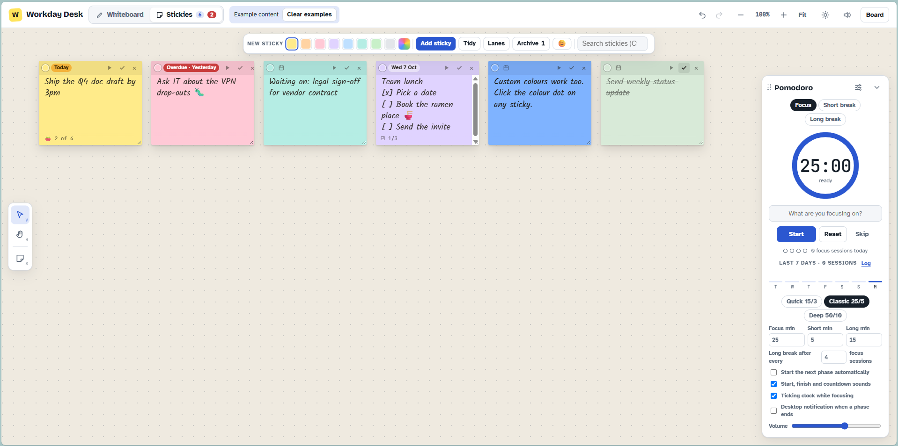
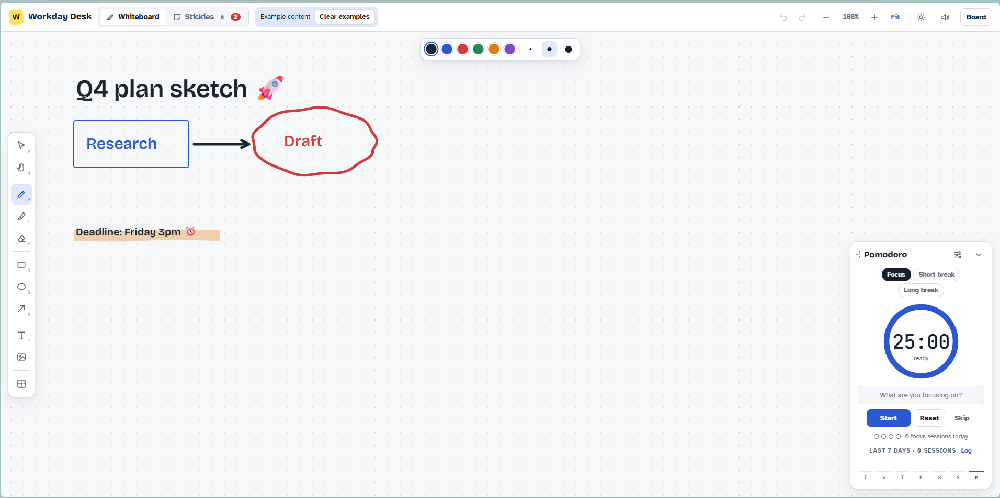

# Focusboard

A small desk for the working day. Focusboard has a whiteboard for sketching ideas, a sticky note board for keeping track of what needs doing, and a Pomodoro timer that floats on top of both.

## What it does

### Whiteboard

- Pen, highlighter, eraser, rectangles, ellipses, arrows and text
- Lasso select to move, recolour or delete several things at once
- Paste a screenshot with Ctrl+V, or drag one in, and draw on top of it
- Background templates: priority matrix, week planner, meeting agenda and retro
- Emoji in text, or dropped on the board as stickers

### Stickies

- Eight colours plus a custom colour picker
- Due dates that turn amber on the day and red when overdue
- Tick a sticky done and it fades out with a little chime
- Optional To do / Doing / Done lanes, and Tidy to sort everything into them
- Search with Ctrl+F
- Archive finished stickies, then copy the last seven days as text for a status update

### Pomodoro timer

- Focus, short break and long break, with a long break after every four sessions
- Press play on a sticky to focus on it, and the sticky keeps a count of sessions
- Start, tick, countdown and finish sounds, with sound and ticking controls
- Drag it anywhere, or collapse it to a small pill
- A strip showing your focus sessions over the last seven days

## Using it

Download the HTML file and open it in Chrome, Edge, Firefox or Safari. No installation or build step is needed.

A few shortcuts worth knowing:

| Key | Does |
| --- | --- |
| 1 / 2 | Switch between Whiteboard and Stickies |
| V, H, P, L, E | Select, pan, pen, highlighter, eraser |
| R, O, A, T | Rectangle, ellipse, arrow, text |
| Space + drag | Pan around the board |
| Ctrl + scroll | Zoom |
| F | Fit everything on screen |
| Ctrl+Z / Ctrl+Shift+Z | Undo and redo |

## Where your stuff is saved

Everything lives in your browser's local storage, so it stays in the browser and on the computer you use it on. Clearing your browser data will wipe it, and it won't follow you to another device.

Use the Board menu to copy a backup and keep it somewhere safe. You can restore a backup from a file or by pasting it back into the app.

---

## ☕ Support

If you find Focusboard helpful, consider buying me a coffee!

